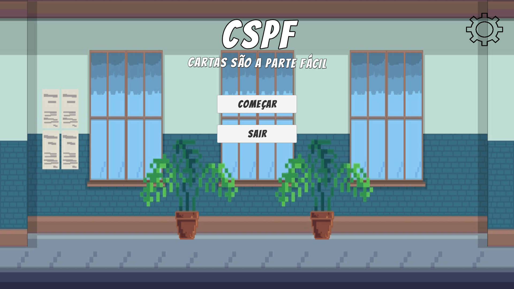
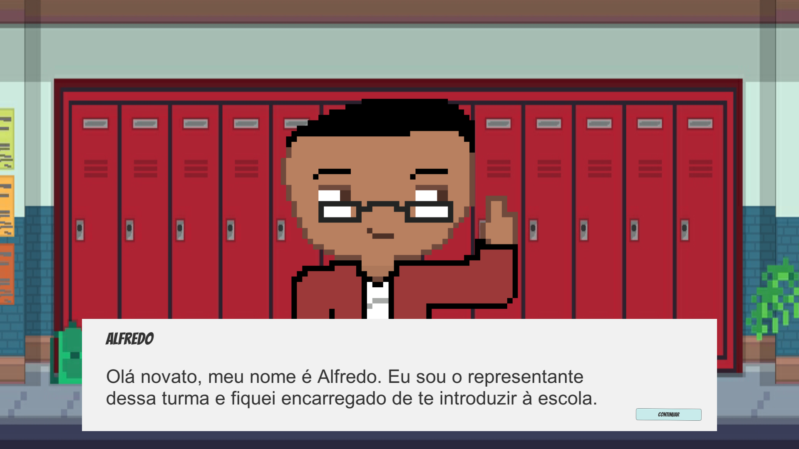

# Cards Are the Easy Part | Cartas São a Parte Fácil (CSPF)

CSPF, is an Educational Card Game.

It's free and open source. :clap:

| [:sparkles: Getting Started](#getting-started) | [:rocket: Download](#download) | [:camera: Screenshots](#screenshots) |
| --------------- | -------- |  -------- |

## Getting Started

Follow the below instructions to get started with CSPF source code:

1. [Make sure you have all Requirements](#requirements)
2. [Download Source Code](#download)
3. Open Project in Unity and Enjoy!

## Requirements

Make sure you have the below requirements before starting:

- [Unity Game Engine](https://unity3d.com)
- Basic Knowledge about Unity and C#

## Download

You can get access to CSPF source code by using one of the following ways:

- [:sparkles: Download Source Code](https://github.com/EricMarinho/CSPF-Educational-Math-CardGame/archive/master.zip)
- Clone the repository locally:

```bash
git clone https://github.com/EricMarinho/CSPF.git
```

Also you can also download the build version of CSPF using the following link:

- [:star: Download from Itch.io](https://ilidam.itch.io/cspf)

## Screenshots

<p align="center">
  
</p>

<p align="center">
  
</p>

<p align="center">
  
</p>

## Credits

- Game Engine: [Unity](https://unity3d.com/)
- Thanks to all of the game development community for their awesome help.

## License

Made by [Ilidam](https://github.com/EricMarinho)
